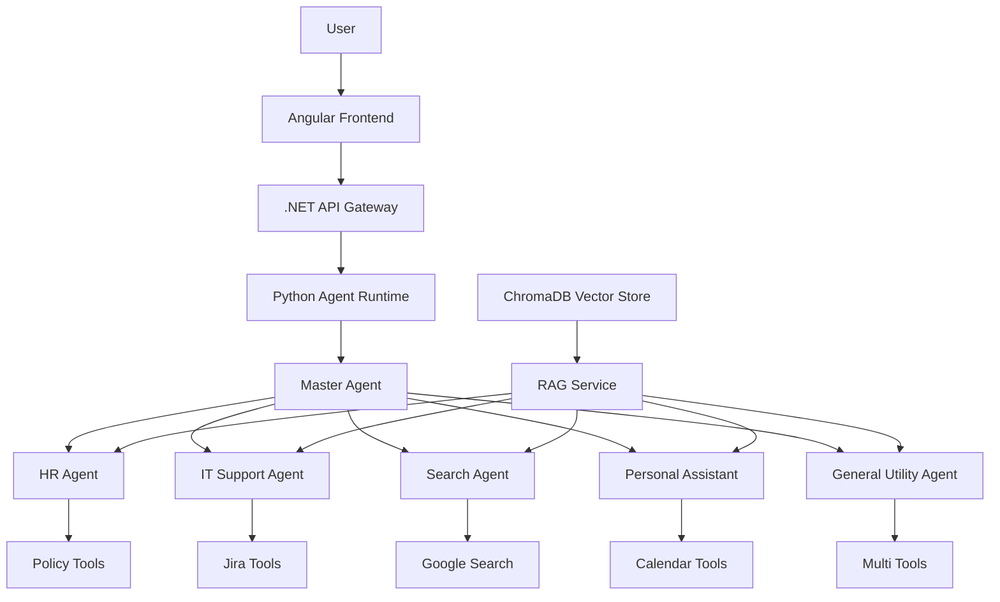
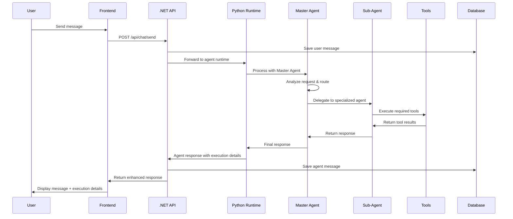
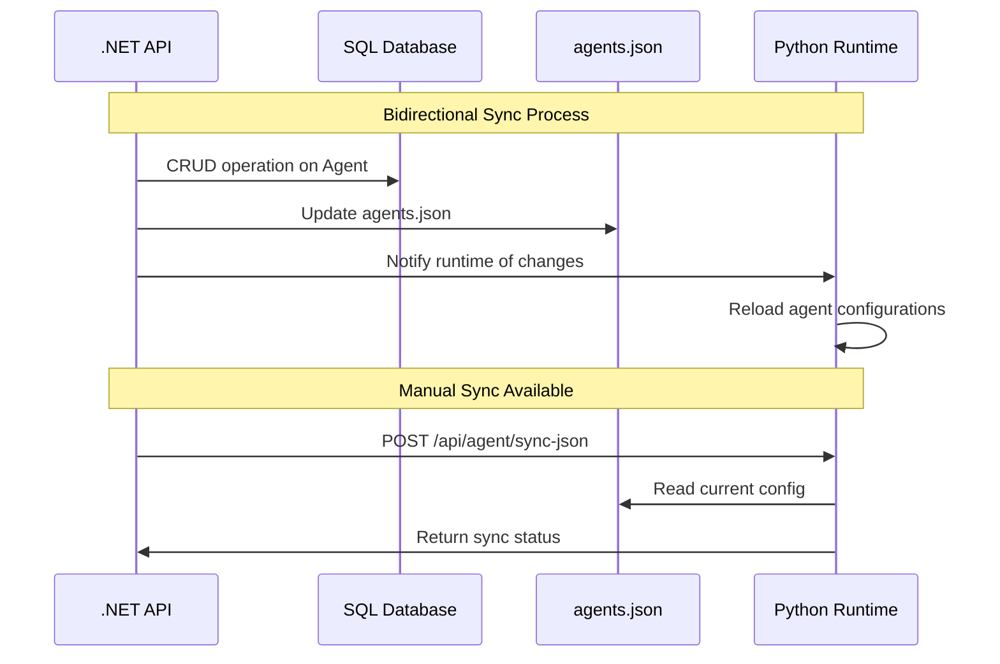
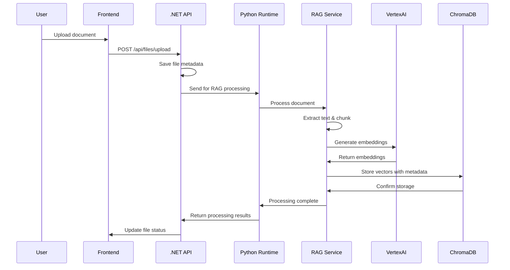

# 🤖 AI Agent Platform - Technical Overview

A comprehensive technical analysis of the multi-agent AI platform featuring intelligent routing, specialized domain agents, dynamic tool integration, and RAG-powered knowledge base.

## 🏗️ System Architecture

### **Multi-Agent Master-Sub Architecture**

This platform implements a sophisticated **Master-Agent pattern** where a central coordinator intelligently routes user requests to specialized sub-agents based on domain expertise.



### **Service Architecture**

| Component | Technology | Port | Purpose |
|-----------|------------|------|---------|
| **Frontend** | Angular 20 + TypeScript | 4200 | Modern SPA with Material Design |
| **Backend API** | .NET 8 Web API | 5000 | REST API, Authentication, Business Logic |
| **Agent Runtime** | Python Flask + LangChain | 8000 | AI Agent Management & Execution |
| **Database** | SQL Server | 1433 | Relational Data & Configuration |
| **Vector DB** | ChromaDB + VertexAI | - | RAG Knowledge Base |

## 🎯 Core Features

### **🤖 Intelligent Agent System**
- **Master Agent Coordinator**: Routes requests to optimal specialized agents
- **6 Specialized Agents**: HR, IT Support, Search, Personal Assistant, General Utility, ADK Assistant
- **Dynamic Tool Integration**: Each agent can use multiple configurable tools
- **JSON-Database Sync**: Bidirectional synchronization between agents.json and SQL database
- **LLM Configuration**: Configurable model (Gemini 2.0 Flash) and temperature per agent

### **🛠️ Advanced Tool Ecosystem**
- **Dynamic Tool Manager**: Runtime tool creation with agent-specific configurations
- **Available Tools**: Jira, Google Search, Gmail, Calendar, Weather, RAG Knowledge Search
- **Credential Management**: Secure tool configuration with environment-based credentials
- **Tool Composability**: Agents can combine multiple tools for complex workflows

### **📚 RAG-Powered Knowledge Base**
- **ChromaDB Vector Storage**: Persistent vector database for document embeddings
- **VertexAI Embeddings**: Google's multilingual embedding model (text-multilingual-embedding-002)
- **Multi-Format Support**: PDF, DOCX, Excel, TXT, Markdown, Web content
- **Agent-Scoped Knowledge**: Documents can be associated with specific agents
- **Intelligent Chunking**: Optimized text splitting with 1000 char chunks, 200 char overlap

### **💬 Enhanced Chat Experience**
- **Real-time Streaming**: WebSocket-based real-time message streaming
- **Execution Transparency**: Detailed view of agent routing and tool usage
- **Conversation Memory**: Persistent chat history with auto-summarization
- **Multi-language Support**: Vietnamese/English with i18n framework

## 🏗️ Technical Stack Deep Dive

### **Frontend Architecture (Angular 20+)**

```typescript
// Modern Angular with Standalone Components & Signals
├── Core Services
│   ├── AuthService (JWT-based authentication)
│   ├── ChatService (Streaming chat with HashbrownAI)
│   ├── AgentService (Agent management)
│   └── ApiService (HTTP interceptors & error handling)
├── Feature Modules
│   ├── Authentication (Login/Register)
│   ├── Chat System (Real-time messaging)
│   ├── Agent Management (CRUD operations)
│   └── File Management (Upload/RAG indexing)
└── Shared Components
    ├── Angular Material UI
    ├── Responsive Design
    └── i18n Internationalization
```

**Key Technologies:**
- **Angular 20.0.3** with standalone components
- **Angular Material 20.0.3** for UI components
- **RxJS 7.8.0** for reactive programming
- **HashbrownAI** packages for AI integration
- **TypeScript 5.8.2** with strict mode
- **ESLint + Prettier** for code quality

### **Backend API Architecture (.NET 8)**

```csharp
// Clean Architecture with DDD Patterns
├── Controllers
│   ├── AuthController (JWT authentication)
│   ├── ChatController (Message handling)
│   ├── AgentController (Agent CRUD + JSON sync)
│   ├── FileController (Upload + RAG processing)
│   └── ToolController (Tool configuration)
├── Services
│   ├── AgentService (Business logic + JSON sync)
│   ├── ChatService (Message orchestration)
│   ├── AgentRuntimeClient (Python API communication)
│   └── FileService (Upload + RAG integration)
├── Data Layer
│   ├── Entity Framework Core
│   ├── SQL Server with migrations
│   └── Repository pattern
└── Infrastructure
    ├── JWT authentication
    ├── Rate limiting
    ├── CORS configuration
    └── Serilog structured logging
```

**Key Technologies:**
- **.NET 8 Web API** with minimal APIs
- **Entity Framework Core** for ORM
- **AutoMapper** for object mapping
- **FluentValidation** for input validation
- **Serilog** for structured logging
- **AspNetCoreRateLimit** for API protection
- **JWT Bearer** authentication

### **Agent Runtime Architecture (Python)**

```python
# LangChain-based Agent System
├── Core Modules
│   ├── MasterAgent (Coordinator with intelligent routing)
│   ├── AgentManager (Dynamic agent creation from JSON)
│   ├── DynamicToolManager (Runtime tool instantiation)
│   └── RAGService (ChromaDB + VertexAI integration)
├── Agent Types
│   ├── HR_Agent (Policy documents, leave requests)
│   ├── IT_Support_Agent (Jira integration, troubleshooting)
│   ├── Search_Agent (Google Search, web research)
│   ├── Personal_Assistant_Agent (Calendar, weather)
│   ├── General_Utility_Agent (Multi-purpose fallback)
│   └── ADK_Assistant_Agent (Advanced AI operations)
└── Toolkit
    ├── JiraTool (Ticket creation/management)
    ├── GoogleSearchTool (Web search capabilities)
    ├── GmailTool (Email operations)
    ├── RAGTool (Knowledge base search)
    └── CalendarTool (Schedule management)
```

**Key Technologies:**
- **LangChain** for agent orchestration
- **Google Generative AI (Gemini 2.0 Flash)** as LLM
- **Flask 2.3.0** for REST API
- **ChromaDB 0.4.18+** for vector storage
- **VertexAI Embeddings** for semantic search
- **Dynamic tool system** with credential management

### **Database Schema**

```sql
-- Core Entities
Agents (
    Id, Name, Department, Description, Instructions,
    Tools (pipe-separated), LlmModelName, LlmTemperature,
    ToolConfigs (JSON), IsActive, IsMainRouter,
    CreatedById, CreatedAt, UpdatedAt
)

Users (
    Id, Username, Email, PasswordHash, FirstName, LastName,
    CreatedAt, UpdatedAt
)

ChatSessions (
    Id, UserId, Title, IsActive, CreatedAt, UpdatedAt
)

ChatMessages (
    Id, ChatSessionId, Content, Role, AgentName, CreatedAt
)

AgentFiles (
    Id, AgentId, FileName, FilePath, ContentType, FileSize,
    UploadedById, CreatedAt, IsIndexed
)

AgentFunctions (
    Id, AgentId, FunctionName, Parameters, CreatedAt
)
```

### **Vector Database (ChromaDB)**

```python
# RAG Service Configuration
├── Document Processing
│   ├── PDF (PyPDF)
│   ├── DOCX (Docx2txt)
│   ├── Excel (UnstructuredExcel)
│   ├── Text/Markdown
│   └── Web Content (BeautifulSoup)
├── Embedding Generation
│   ├── VertexAI text-multilingual-embedding-002
│   ├── Service account authentication
│   └── Batch processing for efficiency
├── Vector Storage
│   ├── ChromaDB persistent client
│   ├── Agent-scoped collections
│   └── Metadata filtering
└── Retrieval
    ├── Similarity search
    ├── Configurable result count
    └── Relevance scoring
```

## 🔄 System Flows

### **1. Chat Message Flow**



### **2. Agent-Database Synchronization**



### **3. RAG Document Processing**



## 🚀 Deployment & CI/CD

### **GitHub Actions Pipeline**

```yaml
# .github/workflows/deploy.yml
name: Deploy to VPS
on:
  push:
    branches: [main]
  workflow_dispatch:

jobs:
  deploy:
    runs-on: ubuntu-latest
    steps:
      - name: Checkout & Archive
      - name: Copy to VPS (SCP)
      - name: Deploy with Docker Compose
        # - Install Docker if needed
        # - Build and start all services
        # - Health check verification
```

### **Docker Multi-Service Setup**

```yaml
# docker-compose.yml
services:
  sqlserver:    # SQL Server 2022
  api:          # .NET 8 Web API
  agent-core:   # Python Flask + LangChain
  frontend:     # Angular + Nginx

volumes:
  sqlserver_data:   # Database persistence
  chroma_db_data:   # Vector database persistence

networks:
  agentplatform-network:  # Internal communication
```

## 🎯 Available Agents & Tools

### **Agent Specifications**

| Agent | Department | Tools | LLM Config | Purpose |
|-------|------------|-------|------------|---------|
| **General Utility** | General | google_search, check_calendar, check_weather | Gemini 2.0 (temp: 0.4) | Versatile fallback agent |
| **IT Support** | IT | jira_ticket_creator, it_knowledge_base_search | Gemini 2.0 (temp: 0.0) | Technical support & troubleshooting |
| **HR Agent** | HR | policy_document_search, leave_request_tool | Gemini 2.0 (temp: 0.7) | HR policies & procedures |
| **Search Agent** | General | google_search | Gemini 2.0 (temp: 0.5) | Web research & information |
| **Personal Assistant** | General | check_calendar, check_weather | Gemini 2.0 (temp: 0.3) | Schedule & daily planning |
| **ADK Assistant** | AI Research | adk_search, adk_http_request, adk_workflow | Gemini 2.0 (temp: 0.2) | Advanced AI operations |

### **Tool Ecosystem**

```json
// Dynamic Tool Configuration
{
  "tools": [
    {
      "id": "google_search_tool",
      "name": "Google Search",
      "file": "google_search_tool.py",
      "description": "Web search capabilities",
      "parameters": {
        "google_api_key": {"type": "string", "is_credential": true},
        "google_cse_id": {"type": "string", "is_credential": true}
      }
    },
    {
      "id": "jira_tool", 
      "name": "Jira Integration",
      "file": "jira_tool.py",
      "description": "Ticket management",
      "parameters": {
        "jira_url": {"type": "string", "is_credential": true},
        "jira_token": {"type": "string", "is_credential": true}
      }
    },
    {
      "id": "knowledge_search_tool",
      "name": "RAG Knowledge Search", 
      "file": "rag_tool.py",
      "description": "Document knowledge base search"
    }
  ]
}
```

## 📁 Project Structure

```
ai-agent-platform/
├── 🐳 docker-compose.yml          # Full stack orchestration
├── 🔧 .github/workflows/          # CI/CD pipeline
├── 📄 env.template                # Environment configuration
├── 
├── 🖥️ frontend/                    # Angular Frontend
│   ├── src/app/
│   │   ├── features/              # Feature modules
│   │   │   ├── auth/              # Authentication
│   │   │   ├── chat/              # Chat system
│   │   │   └── agent-management/  # Agent CRUD
│   │   ├── core/                  # Core services & guards
│   │   └── shared/                # Shared components
│   ├── angular.json               # Angular CLI config
│   ├── package.json               # NPM dependencies
│   └── Dockerfile                 # Production build
│
├── 🏗️ backend/                     # .NET Backend
│   ├── AgentPlatform.API/         # Main Web API
│   │   ├── Controllers/           # REST endpoints
│   │   ├── Services/              # Business logic
│   │   ├── Models/                # Entity models
│   │   ├── Data/                  # EF Core context
│   │   └── Migrations/            # Database migrations
│   │
│   ├── AgentPlatform.Core/        # Python Agent Runtime  
│   │   ├── core/                  # Agent system
│   │   │   ├── master_agent.py    # Master coordinator
│   │   │   ├── agent_manager.py   # Agent lifecycle
│   │   │   ├── dynamic_tool_manager.py  # Tool system
│   │   │   └── rag_service.py     # ChromaDB integration
│   │   ├── toolkit/               # Available tools
│   │   ├── agents.json            # Agent configurations
│   │   ├── api_server.py          # Flask API server
│   │   └── requirements.txt       # Python dependencies
│   │
│   └── AgentPlatform.Shared/      # Shared models
│
└── 📚 docs/                        # Documentation
    ├── business_specs/            # Business requirements
    ├── tech_specs/                # Technical specifications
    └── API documentation
```

## 🔐 Security & Performance

### **Security Features**
- **JWT Authentication**: Secure token-based auth with refresh tokens
- **Rate Limiting**: API protection against abuse
- **Input Validation**: FluentValidation for all inputs
- **CORS Configuration**: Controlled cross-origin access
- **Environment Variables**: Secure credential management
- **SQL Injection Protection**: Entity Framework parameterized queries

### **Performance Optimizations**
- **Async/Await Patterns**: Non-blocking I/O operations
- **Connection Pooling**: Efficient database connections
- **Caching Strategies**: Memory caching for frequent data
- **Streaming Responses**: Real-time chat with minimal latency
- **Docker Multi-Stage Builds**: Optimized container images
- **Index Optimization**: Database performance tuning

### **Monitoring & Logging**
- **Structured Logging**: Serilog with JSON output
- **Request Tracing**: End-to-end request tracking
- **Agent Execution Logging**: Detailed agent operation logs
- **Health Check Endpoints**: Service availability monitoring
- **Error Tracking**: Comprehensive error handling

## 🌟 API Documentation

### **Chat Endpoints**
```http
POST /api/chat/send
GET  /api/chat/history?page={page}&pageSize={pageSize}
GET  /api/chat/sessions/{sessionId}
DELETE /api/chat/sessions/{sessionId}
```

### **Agent Management**
```http
GET    /api/agent                    # List all agents
GET    /api/agent/{id}               # Get specific agent
POST   /api/agent                    # Create new agent
PUT    /api/agent/{id}               # Update agent
DELETE /api/agent/{id}               # Soft delete agent
POST   /api/agent/sync-json          # Manual JSON sync
```

### **File & RAG Operations**
```http
POST   /api/files/upload             # Upload & index document
GET    /api/files/agent/{agentId}    # List agent files
DELETE /api/files/{fileId}           # Delete file & embeddings
```

### **Request/Response Examples**

#### Create Agent
```json
POST /api/agent
{
  "name": "Sales_Support_Agent",
  "department": "Sales", 
  "description": "Specialized sales support with CRM integration",
  "tools": ["crm_search", "lead_tracker", "knowledge_search_tool"],
  "llmConfig": {
    "modelName": "gemini-2.0-flash",
    "temperature": 0.3
  },
  "toolConfigs": {
    "crm_search": {
      "crm_api_key": "{{CRM_API_KEY}}",
      "crm_url": "{{CRM_URL}}"
    }
  }
}
```

#### Send Chat Message
```json
POST /api/chat/send
{
  "message": "Create a Jira ticket for login issues",
  "agentName": "IT_Support_Agent",
  "sessionId": 123
}

Response:
{
  "response": "I've created Jira ticket PROJ-456 for the login issues...",
  "agentName": "IT_Support_Agent", 
  "sessionId": 123,
  "agentsUsed": ["IT_Support_Agent"],
  "toolsUsed": ["jira_ticket_creator"],
  "executionDetails": {
    "totalSteps": 2,
    "executionSteps": [
      {
        "toolName": "jira_ticket_creator",
        "toolInput": "Create ticket for login issues",
        "observation": "Successfully created ticket PROJ-456"
      }
    ]
  },
  "masterAgentThinking": "User needs IT support, routing to IT agent..."
}
```

## 🚀 Production Deployment

### **VPS Deployment with Docker**
```bash
# Automated via GitHub Actions
git push origin main  # Triggers deployment

# Manual deployment
scp -r . user@your-vps:/opt/ai-agent-platform
ssh user@your-vps
cd /opt/ai-agent-platform
docker-compose up -d --build
```

### **Environment Variables**
```env
# Production .env
GOOGLE_API_KEY=your_gemini_api_key
GOOGLE_CLOUD_PROJECT=your_gcp_project
ConnectionStrings__DefaultConnection=production_sql_connection
JWT_SECRET=secure_jwt_secret
ASPNETCORE_ENVIRONMENT=Production
```

### **SSL & Domain Setup**
```nginx
# nginx.conf for HTTPS
server {
    listen 443 ssl;
    server_name your-domain.com;
    
    ssl_certificate /path/to/cert.pem;
    ssl_certificate_key /path/to/key.pem;
    
    location / {
        proxy_pass http://frontend:80;
    }
    
    location /api/ {
        proxy_pass http://api:80;
    }
}
```

## 🤝 Contributing

### **Development Guidelines**
1. **Follow Clean Architecture**: Maintain separation of concerns
2. **Agent Schema Compliance**: Use standardized agent configurations
3. **Database Migrations**: Always create migrations for schema changes
4. **JSON Synchronization**: Test database ↔ agents.json sync after modifications
5. **Tool Development**: Use dynamic tool manager for new tools
6. **Documentation**: Update specs for new features

### **Code Standards**
- **Backend**: C# coding conventions with async/await patterns
- **Frontend**: Angular style guide with TypeScript strict mode
- **Python**: PEP 8 with type hints and docstrings
- **Testing**: Unit tests for critical business logic
- **Security**: Never commit secrets or credentials

## 🔧 Development Setup

### **Prerequisites**
- [Docker Desktop](https://www.docker.com/products/docker-desktop)
- [Node.js 18+](https://nodejs.org/)
- [.NET 8 SDK](https://dotnet.microsoft.com/download/dotnet/8.0)
- [Python 3.11+](https://www.python.org/)

### **Environment Configuration**
```bash
# 1. Clone repository
git clone <repository-url>
cd ai-agent-platform

# 2. Configure environment
cp env.template .env
# Edit .env and set:
# - GOOGLE_API_KEY (required for Gemini AI)
# - Database passwords
# - Optional: Google Cloud credentials for VertexAI

# 3. Start full stack
docker-compose up -d

# 4. Access applications
# Frontend: http://localhost:4200
# Backend API: http://localhost:5000
# Agent Runtime: http://localhost:8000
# API Documentation: http://localhost:5000/swagger
```

### **Development Workflows**

```bash
# Backend Development
cd backend
docker-compose up -d sqlserver  # Start database only
cd AgentPlatform.API
dotnet ef database update      # Apply migrations
dotnet run                     # Start API

# Frontend Development  
cd frontend
npm install
ng serve                       # Start dev server

# Agent Development
cd backend/AgentPlatform.Core
python -m venv venv
source venv/bin/activate
pip install -r requirements.txt
python main.py                 # Start agent runtime
```

---

**🌟 Built with cutting-edge technologies:** Angular 20, .NET 8, Python, LangChain, ChromaDB, Google Gemini AI, and Docker

**🚀 Production-ready with:** JWT auth, rate limiting, structured logging, health checks, CI/CD, and comprehensive monitoring

**🤖 AI-powered features:** Master-agent routing, dynamic tool management, RAG knowledge base, and multi-language support 