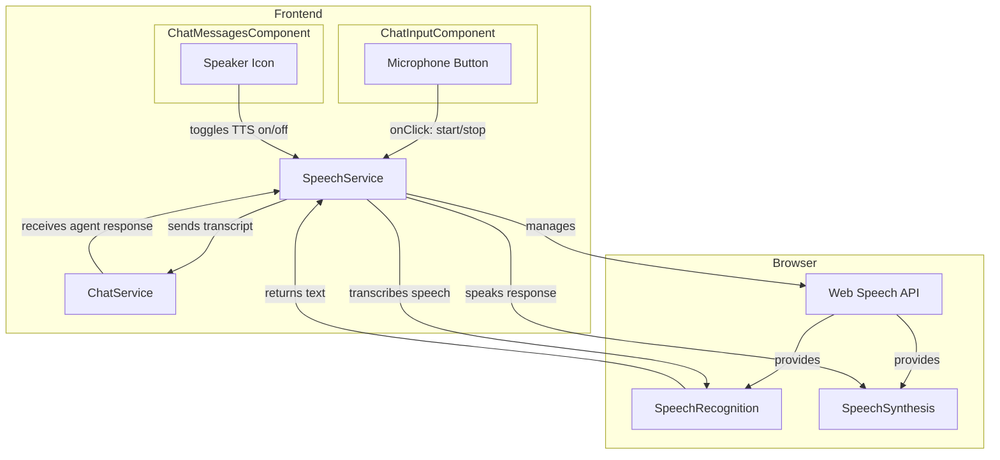

# Technical Specification: Voice Chat with Web Speech API

## 1. Introduction

This document outlines the technical design and implementation plan for integrating voice-based interaction into the chat feature of the AI Agent Platform. This will allow users to speak their queries to the agent and hear the agent's responses spoken back to them. The implementation will leverage the [Web Speech API](https://developer.mozilla.org/en-US/docs/Web/API/Web_Speech_API), which provides browser-native capabilities for speech recognition and speech synthesis.

This feature will be composed of two main parts:
*   **Speech-to-Text (STT):** Capturing user voice input via the microphone and transcribing it into text to be sent to the agent.
*   **Text-to-Speech (TTS):** Speaking the agent's text responses aloud to the user.

## 2. Requirements

### 2.1. Functional Requirements

*   Users must be able to initiate a voice input session by clicking a microphone icon in the chat input area.
*   While recording, the user's spoken words should appear as an interim transcript in the input field.
*   Users must be able to stop the voice input session manually.
*   When the user stops speaking, the final transcript should be automatically sent as a message to the agent.
*   The agent's text response should be automatically read aloud.
*   Users must be able to enable or disable the text-to-speech functionality.

### 2.2. Non-Functional Requirements

*   The feature must check for browser compatibility and gracefully degrade if the Web Speech API is not supported.
*   The system must request microphone permissions from the user and handle cases where permission is denied.
*   The UI must provide clear visual feedback for different states: idle, listening, processing, and speaking.
*   The implementation should be encapsulated within a dedicated Angular service to ensure modularity and reusability.

## 3. Architecture & Design

We will create a new `SpeechService` in Angular to encapsulate all logic related to the Web Speech API. This service will be injected into the relevant components, primarily the `ChatInputComponent`, to drive the voice chat functionality.

### 3.1. High-Level Diagram



### 3.2. `SpeechService` Design

A new service, `SpeechService`, will be created at `frontend/src/app/core/services/speech.service.ts`.

**Public API:**

*   **Properties:**
    *   `isListening$`: An observable `BehaviorSubject<boolean>` that emits the current listening state.
    *   `isSpeaking$`: An observable `BehaviorSubject<boolean>` that emits the current TTS speaking state.
    *   `transcript$`: An observable `Subject<string>` that emits the interim and final speech recognition transcripts.
    *   `error$`: An observable `Subject<string>` to report errors (e.g., 'no-speech', 'not-allowed').
    *   `isTextToSpeechEnabled`: A writable signal to control the TTS functionality.

*   **Methods:**
    *   `constructor()`: Checks for Web Speech API support.
    *   `startListening(lang: string = 'en-US')`: Initializes and starts the `SpeechRecognition` engine.
    *   `stopListening()`: Manually stops the recognition engine.
    *   `speak(text: string, lang: string = 'en-US')`: Initializes and runs the `SpeechSynthesis` engine to speak the provided text.
    *   `cancel()`: Stops any ongoing speech synthesis.

### 3.3. Component Integration

*   **`ChatInputComponent`:**
    *   Will inject `SpeechService`.
    *   A microphone button will be added to the component's template.
    *   The button's state (icon, tooltip) will be bound to `speechService.isListening$`.
    *   Clicking the button will call `speechService.startListening()` or `speechService.stopListening()`.
    *   The component will subscribe to `speechService.transcript$` to update the chat input field's value. When a final transcript is received, it will be sent via the `ChatService`.

*   **`ChatPageComponent`:**
    *   Will inject `SpeechService`.
    *   When a new message arrives from the agent, it will check if `speechService.isTextToSpeechEnabled()` is true.
    *   If enabled, it will call `speechService.speak(message.text)`.

## 4. Implementation Details

### 4.1. Speech Recognition (STT)

The `SpeechService` will manage a `webkitSpeechRecognition` (or `SpeechRecognition`) instance.

```typescript
// Inside SpeechService

private recognition: any;

constructor() {
    const SpeechRecognition = (window as any).SpeechRecognition || (window as any).webkitSpeechRecognition;
    if (SpeechRecognition) {
        this.recognition = new SpeechRecognition();
        this.recognition.continuous = false; // Ends recognition when user stops talking
        this.recognition.interimResults = true; // Provides real-time results
        this.setupRecognitionListeners();
    } else {
        // API not supported, disable feature
    }
}

startListening(lang: string) {
    if (this.recognition) {
        this.recognition.lang = lang;
        this.recognition.start();
    }
}

private setupRecognitionListeners(): void {
    this.recognition.onstart = () => {
        this.isListening$.next(true);
    };

    this.recognition.onresult = (event: any) => {
        let interim_transcript = '';
        let final_transcript = '';

        for (let i = event.resultIndex; i < event.results.length; ++i) {
            if (event.results[i].isFinal) {
                final_transcript += event.results[i][0].transcript;
            } else {
                interim_transcript += event.results[i][0].transcript;
            }
        }
        // Emit final transcript with a special prefix to distinguish
        this.transcript$.next(final_transcript ? `FINAL:${final_transcript}` : interim_transcript);
    };

    this.recognition.onend = () => {
        this.isListening$.next(false);
    };

    this.recognition.onerror = (event: any) => {
        this.error$.next(event.error);
    };
}
```

### 4.2. Text-to-Speech (TTS)

The service will use `window.speechSynthesis`.

```typescript
// Inside SpeechService

private synthesizer: SpeechSynthesis;

constructor() {
    this.synthesizer = window.speechSynthesis;
    // ... other constructor logic
}

speak(text: string, lang: string) {
    if (this.synthesizer.speaking) {
        this.synthesizer.cancel();
    }

    if (text !== '' && this.isTextToSpeechEnabled()) {
        const utterance = new SpeechSynthesisUtterance(text);
        utterance.lang = lang;
        utterance.onstart = () => this.isSpeaking$.next(true);
        utterance.onend = () => this.isSpeaking$.next(false);
        utterance.onerror = () => this.isSpeaking$.next(false);
        this.synthesizer.speak(utterance);
    }
}
```

## 5. User Flow

1.  User clicks the microphone icon in `ChatInputComponent`.
2.  The browser requests microphone permission (if not already granted).
3.  The icon changes to a "listening" state.
4.  User speaks. Their words appear in the input box in real-time.
5.  User stops speaking. The `onend` event fires, `isListening$` becomes `false`, and the final transcript is sent as a message.
6.  The agent processes the message and returns a response.
7.  `ChatPageComponent` receives the response and, if TTS is enabled, calls `speechService.speak()`.
8.  The browser reads the response aloud.

--- 